<br />
[GitHub](https://github.com/dec1costello) | [Kaggle](https://www.kaggle.com/dec1costello) | [LinkedIn](https://www.linkedin.com/in/declan-costello-7423aa137/)
<br />
Author: Declan Costello

<p align="center">
  

</p>

<h1 align="center">Ski Pass Renewal Prediction</h1>


**Business Objective:** Predict ski pass renewal likelihood to maximize lifetime customer value. Prioritized recall for the 'will not renew' class to ensure coverage of the at-risk population.

**Technical Approach:** A production grade ML pipeline leveraging modern analytics engineering patterns. Features are defined in SQL (dbt), persisted in DuckDB, and consumed by Python ML workflows, ensuring reproducibility, version control, and auditability.

**Key Results:**
- ✅ **Feature Store:** SQL defined, version controlled feature engineering
- ✅ **Reproducible ML:** Deterministic training with hyperparameter optimization
- ✅ **Operational Analytics:** Predictions stored as tables for BI consumption
- ✅ **Minimal Infrastructure:** Single DuckDB file serves as both warehouse and feature store

**Architecture Rationale:** DuckDB was selected over Snowflake/AWS for its embedded nature, eliminating cloud costs while maintaining SQL compliance and performance for datasets under 100GB.

## 🏗️ Architecture Diagram

This ski pass renewal prediction system operates on a "single source of truth" principle with DuckDB as the central analytical engine. Customer data flows through automated cleaning and feature engineering pipelines, then machine learning models generate renewal likelihood scores that are directly stored as business ready tables. This design eliminates data silos and infrastructure complexity, allowing marketing teams to immediately access predictive insights through standard business intelligence tools while data scientists maintain full reproducibility.

```mermaid
graph LR
    %% === ENHANCED VISUAL STYLING ===
    classDef external fill:#8B4513,stroke:#3d2b1f,stroke-width:2px,color:#fff
    classDef duck_outer fill:#fff0f0,stroke:#FF6B6B,stroke-width:2px,stroke-dasharray: 5 5,color:#c53030
    classDef bronze fill:#9c4221,stroke:#5a2d1a,stroke-width:2px,color:#ffd8b2
    classDef silver fill:#f3f4f6,stroke:#9ca3af,stroke-width:2px,color:#374151
    classDef gold fill:#fef3c7,stroke:#eab308,stroke-width:2px,color:#854d0e
    classDef ml_logic fill:#e0f7fa,stroke:#00bcd4,stroke-width:2px,color:#006064
    classDef ml_output fill:#e3f2fd,stroke:#2196f3,stroke-width:2px,color:#0d47a1
    classDef python_outer fill:#f0f9ff,stroke:#38bdf8,stroke-width:2px,color:#0369a1

    %% === EXTERNAL DATA SOURCE ===
    RAW_TXT["📄 data/bronze/*.txt<br/>Raw Source Data"]

    %% === DUCKDB WAREHOUSE CONTAINER ===
    subgraph DUCKDB ["🦆 DuckDB Warehouse<br/>warehouse/ski.duckdb"]
        
        %% Bronze Storage (inside DuckDB)
        RAW_STG["Bronze Raw<br/>Staged Tables"]
        
        %% dbt Transformation Layer
        subgraph DBT_TRANSFORM ["⚙️ dbt Transformation"]
            direction LR
            SILVER_SQL["silver/<br/>Cleaned Tables"]
            GOLD_SQL["gold/<br/>Feature Tables"]
        end
        
        %% ML Knowledge Base
        subgraph ML_KNOWLEDGE ["🤖 ML Knowledge Base"]
            MODEL_TABLE["Trained Models"]
            METRICS_TABLE["Validation Metrics"]
            PREDS_TABLE["Batch Predictions"]
        end
    end

    %% === PYTHON RUNTIME ENVIRONMENT ===
    subgraph PYTHON ["🐍 Python ML Runtime"]
        direction TB
        TRAIN_PY["train.py<br/>+ Optuna Tuning"]
        EVAL_PY["evaluate.py<br/>Metrics & Validation"]
        PRED_PY["predict.py<br/>Batch Inference"]
    end

    %% === DATA FLOW ===
    RAW_TXT -->|"📥 Initial Load"| RAW_STG
    
    %% Internal DuckDB Flow
    RAW_STG -->|"🗃️ Raw Data"| SILVER_SQL
    SILVER_SQL -->|"✨ Clean & Transform"| GOLD_SQL
    
    %% ML Training Cycle
    GOLD_SQL -.->|"🔍 Read Features"| TRAIN_PY
    TRAIN_PY -->|"⚡ Train Model"| EVAL_PY
    
    %% ML Inference Cycle
    GOLD_SQL -.->|"🔍 Read Features"| PRED_PY
    
    %% Persistence to DuckDB
    TRAIN_PY -->|"💾 Save Model"| MODEL_TABLE
    EVAL_PY -->|"📊 Log Metrics"| METRICS_TABLE
    PRED_PY -->|"📝 Write Results"| PREDS_TABLE
    
    %% Subtle Feedback Visualization
    MODEL_TABLE -.->|"🔄"| GOLD_SQL
    METRICS_TABLE -.->|"📈"| GOLD_SQL

    %% === APPLY STYLES ===
    class RAW_TXT external;
    class DUCKDB duck_outer;
    class RAW_STG bronze;
    class SILVER_SQL silver;
    class GOLD_SQL gold;
    class TRAIN_PY,EVAL_PY,PRED_PY ml_logic;
    class MODEL_TABLE,METRICS_TABLE,PREDS_TABLE ml_output;
    class PYTHON python_outer;
```



<br />

## 🚀 Quick Start

This project uses **[uv](https://docs.astral.sh/uv/)** for deterministic dependency management for reproducible ML and pipelines. The entire environment is defined in `pyproject.toml` and locked in `uv.lock`, guaranteeing identical execution across development, CI, and production.

#### Prerequisites
- **Python 3.11+**
- **Git**
- **Terminal access**

#### 1. Environment Setup

```bash
# Install uv (one time system setup)
curl -LsSf https://astral.sh/uv/install.sh | sh
# or via pip
pip install uv

# Clone and setup the project
git clone https://github.com/dec1costello/Ski-Pass-Renewal-Prediction.git
cd ski-pass-renewal-prediction

# Recreate the exact development environment
uv sync --frozen
```

#### 2. Verify Installation

```bash
# Test critical imports
uv run python -c "import duckdb, xgboost, sklearn; print('✓ Environment ready')"

# Check dbt availability
uv run dbt --version
```

#### 3. Execution Workflow

Execute the complete pipeline using the following commands:

| Step | Purpose | Command |
|------|---------|---------|
| **Data Pipeline** | Transform raw data → silver → gold features | `uv run dbt run --select silver+` |
| **Training** | Train model with hyperparameter optimization | `uv run python src/models/train.py` |
| **Evaluation** | Generate performance metrics and validation | `uv run python src/models/evaluate.py` |
| **Prediction** | Run batch inference on latest data | `uv run python src/models/predict.py` |

> [!TIP]
> Use `uv run` before any Python command to guarantee execution with the locked environment. This ensures consistent Python versions and dependency trees across all machines.


